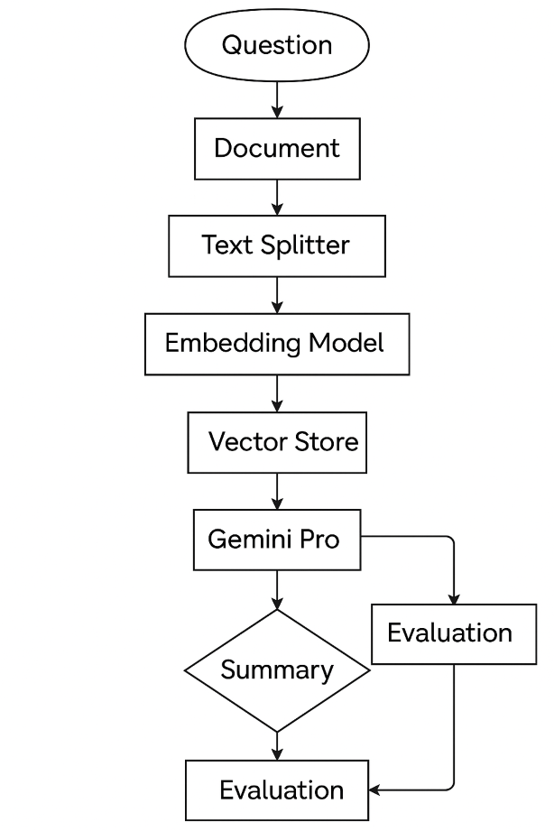

# GenAI Document Summarizer & Evaluator

📺 **Video Presentation:** [YouTube Walkthrough](https://youtu.be/CcCR48S1tf8)  
🔗 **Kaggle Notebbok:** [Submitted for Competition](https://www.kaggle.com/code/alibaghizadeh/summarize-and-evaluate-technical-information)

---

## Introduction

Welcome! This project is my capstone for the **[Google 5-Day GenAI Intensive Course](https://rsvp.withgoogle.com/events/google-generative-ai-intensive_2025q1)**. It solves a common problem: *how to quickly understand and summarize information from many technical documents—PDFs, research papers, and web articles—without spending hours reading*.

Using Google’s *Gemini models*, *LangChain orchestration*, and a *ChromaDB vector database*, the app:  
1. **Ingests** text from uploaded PDFs or URLs.  
2. **Searches** content with semantic vector search (RAG).  
3. **Summarizes** answers to user queries with Gemini Pro in structured JSON.  
4. **Evaluates** summary quality automatically with Gemini Flash.  

This tool saves time, boosts learning, and helps professionals grasp key points from dense material.

---

## The Challenge

The problem I am trying to address in this project is my personal bottleneck problem in reading and summarizing information on my areas of interest in AI, particularly computer vision.

- **Information Overload:** AI research moves fast. Papers, blogs, and code are spread across many sources.  
- **Manual Work:** Reading and summarizing wastes time and can miss crucial facts.

**Goal:** Build an AI assistant that reads documents, answers questions, and checks its own work.

---

## Case Study: Vision Transformers in Microscopy

This is not the final solution to learn and review a topic. However, this is a first step to review tens of references I have collected, and I would like to choose some of the most relevant references to my topic of interest. Using GenAI, I will have a quick review of the content of my references and which one is more suitable for my research or study. I wish I had such impressive tools during my PhD, as it could have accelerated my literature review and helped me to choose the right references for the specific topic of interest. I have to mention that I have already developed ***[a RAG solution based on OpenAI API to search the PDF files](https://github.com/AliBaghizadeh/OpenAI_RAG_Scientific_Articles)*** to search the PDF files for specific information, like numbers or physical quantities, which have been discussed in the papers. Acquiring the information from literature is essential in scientific research, and it is very time-consuming when it is done manually. I believe that small GenAI solutions are increasing the speed of scientific research, as every day thousands of articles and scientific texts are being published, and there is no simple solution to manually extract relevant information from all these resources.

To show the app in action, I used a real-world example: Vision Transformers for image processing in scientific microscopy. By feeding articles and papers into the tool, I quickly got concise summaries of how attention mechanisms help or hinder performance.

---

## GenAI Pipeline & Detailed Workflow

Below is the step-by-step pipeline used in both the Kaggle notebook and the Streamlit app.

### 1. Asking the Question
```python
user_question = "What are the main benefits of Vision Transformers?"
```
- **user_question**: Stores the user’s query so the AI knows what information to look for in the documents.

### 2. Loading Documents
```python
reader = PdfReader("example.pdf")

response = requests.get(url)
soup = BeautifulSoup(response.text, "html.parser")
web_text = soup.get_text()
```
- **PdfReader("example.pdf")**: Opens the PDF file for text extraction.  
- **page.extract_text()**: Extracts text from each page of the PDF.  
- **requests.get(url)**: Retrieves the raw HTML of the given web URL.  
- **BeautifulSoup(...).get_text()**: Parses HTML and extracts visible text content.

### 3. Splitting Text into Chunks
```python
splitter = RecursiveCharacterTextSplitter(
    chunk_size=1500,
    chunk_overlap=200
)
chunks = splitter.split_text(text + web_text)
```
- **RecursiveCharacterTextSplitter**: Configures how the text is broken into smaller pieces.  
- **chunk_size=1500**: Sets maximum characters per chunk.  
- **chunk_overlap=200**: Keeps overlap between chunks to preserve context.  
- **split_text(...)**: Splits the combined text into a list of chunks.

### 4. Embedding Chunks
```python
class GeminiEmbeddingFunction(EmbeddingFunction):
    def __call__(self, input_texts: Documents) -> Embeddings:
        return client.models.embed_content(
            model="models/text-embedding-004",
           ...
        )

embedding_fn = GeminiEmbeddingFunction()
vectors = embedding_fn(chunks)
```
- **GeminiEmbeddingFunction**: Defines a custom function to call Google’s embedding API.  
- **embed_content(model, texts)**: Converts text chunks into semantic vector representations.  
- **vectors = embedding_fn(chunks)**: Generates vectors for all chunks for later similarity search.

### 5. Storing & Retrieving with ChromaDB
```python
client = chromadb.Client()
collection = client.get_or_create_collection(
    name="capstone_collection",
    embedding_function=embedding_fn
)
collection.add(
    documents=chunks,
    metadatas=[{"source": "pdf_or_url"} for _ in chunks],
    ...
)

results = collection.query(
    query_texts=[user_question],
    n_results=5,
    include=["documents", "metadatas"]
)
```
- **chromadb.Client()**: Connects to a local or cloud vector database.  
- **get_or_create_collection(name, embedding_function)**: Creates a named collection to store your embeddings.  
- **collection.add(...)**: Saves chunks, metadata, and unique IDs into the collection.  
- **collection.query(...)**: Retrieves the top 5 most relevant chunks matching the query vector.

### 6. Summarization with Gemini Pro
```python
llm = ChatGoogleGenerativeAI(
    model="models/gemini-1.5-pro",
    generation_config={"response_mime_type": "application/json"}
)
summary_response = llm.invoke(
    prompt=compose_summary_prompt(results)
)
summary = summary_response.json()
```
- **ChatGoogleGenerativeAI(model, generation_config)**: Initializes the LLM with JSON output settings.  
- **llm.invoke(prompt)**: Sends the retrieved chunks as a prompt to generate a structured summary.  
- **summary_response.json()**: Parses the JSON-formatted summary into a Python object.

### 7. Quality Evaluation with Gemini Flash
```python
eval_llm = ChatGoogleGenerativeAI(model="models/gemini-1.5-flash")
review = eval_llm.invoke(
    prompt=compose_evaluation_prompt(summary, results)
)
evaluation = review.text
```
- **ChatGoogleGenerativeAI(model)**: Sets up the evaluation LLM.  
- **eval_llm.invoke(prompt)**: Sends the summary and context for automated quality scoring.  
- **review.text**: Retrieves the evaluation feedback as plain text.

### 8. Displaying Results in Streamlit
```python
st.header("Summary")
st.json(summary)

st.header("Evaluation")
st.write(evaluation)
```
- **st.header(...)**: Adds a section title in the Streamlit app.  
- **st.json(summary)**: Renders the structured JSON summary neatly.  
- **st.write(evaluation)**: Displays the evaluation score and comments.



---

## Key Features

- **Multi‑Source Ingestion**: PDFs & URLs in one app.  
- **Retrieval‑Augmented Generation (RAG)**: ChromaDB + Gemini embeddings.  
- **Structured Summaries**: JSON for easy parsing.  
- **Automated Evaluation**: Built-in quality check.  
- **Interactive UI**: Simple Streamlit interface.

---

## GenAI Capabilities Demonstrated

- Document Understanding (PDF & HTML parsing)  
- Embeddings & Vector Search (ChromaDB)  
- Retrieval‑Augmented Generation (RAG)  
- Large Language Models (Gemini Pro & Flash)  
- Controlled JSON Generation
- Pipeline Orchestration (LangGraph): Manages splitting, embedding, prompt building, and evaluation calls
- GenAI Evaluation via function calling  
- Few‑Shot Prompting and Agents

---

## Quick Start & Setup

1. **Clone Repo**
   ```bash
   git clone https://github.com/your-username/your-repo.git
   cd your-repo
   ```

2. **Create & Activate Virtual Env**
   ```bash
   python3 -m venv venv
   source venv/bin/activate   # macOS/Linux
   .env\Scripts\Activate.ps1 # Windows PowerShell
   ```

3. **Install**
   ```bash
   pip install -r requirements.txt
   ```

4. **Configure API Key**
   Enable the Generative Language API in Google Cloud and add your key to `~/.streamlit/secrets.toml`.

---

## How to Run

```bash
streamlit run app.py
```

Your browser will open the Streamlit interface—upload PDFs/URLs, enter your query, and get your summary + quality score.

---

## Project Structure

```
project-folder/
├── app.py              # Streamlit UI
├── pipeline.py         # Core logic
├── config.py           # Settings
├── requirements.txt    # Dependencies
├── chroma_capstone_db/ # ChromaDB data
├── Flowchart.png       # Pipeline diagram
└── README.md           # This file
```

---

## Limitations & Future Work

**Limitations:**

- **Complex PDF layouts (tables, formulas)**    
  *Reason:* Many technical PDFs include structured elements like tables, equations, or figures that basic text-extraction tools struggle to parse. Misread or skipped text can mislead the summarization model.

- **Summary quality depends on retrieved context**    
  *Reason:* The retrieval-augmented generation approach is only as good as its search results. If the vector search returns broadly related chunks rather than critical details, the summary may omit or inaccurately represent key information.

- **AI evaluation is helpful but not perfect**    
  *Reason:* Automated scoring by Gemini Flash provides quick feedback, but it remains an LLM output and can be biased or miss subtle factual errors. Human review is still recommended for critical use cases.

**Future Work:**    

- **Multi‑document comparison and contrast**    
  *Why this matters:* Researchers often need to see how different sources agree or conflict. A comparative view would highlight consistencies and discrepancies, improving literature reviews.

- **Conversational chatbot-style Q&A**    
  *Why this matters:* Allowing follow-up questions in a dialogue makes the tool more interactive and suited for exploratory research workflows.

- **OCR integration for scanned documents**    
  *Why this matters:* Many archives are scanned images. Adding OCR support would unlock access to historical or image-based documents.

- **Self‑refinement loops with LLM feedback**   
  *Why this matters:* Feeding evaluation results back into summarization lets the system iteratively correct errors and hallucinations, improving output quality over multiple passes.

---

## Acknowledgements & Thanks

Thank you to the **Google 5‑Day GenAI Intensive Course** instructors and the Kaggle community for the support and feedback!  

> **Author:** Ali Baghi Zadeh     
> **Kaggle Notebook:** https://www.kaggle.com/code/alibaghizadeh/summarize-and-evaluate-technical-information      
> **Video:** https://youtu.be/CcCR48S1tf8      
> **License:** MIT    
